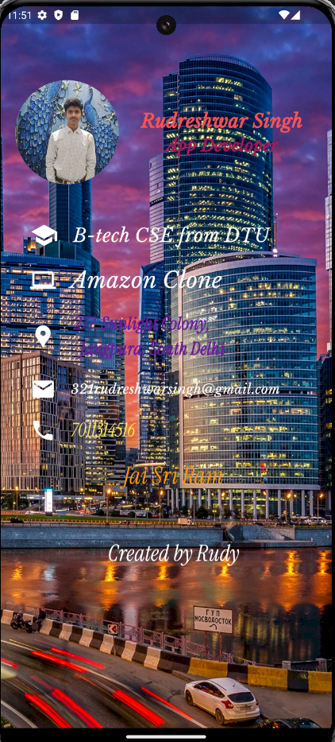

My First Portfolio App

Welcome to My First Portfolio App, a simple Flutter application designed to showcase a personal portfolio with basic details such as name, profession, education, projects, location, email, and phone number.

Features

1.  Circle Avatar: Displays a profile picture.
2.  Text Widgets: Shows personal information including name, profession, education, projects, location, email, and phone number.
3.  Icons: Enhances the display of personal information with relevant icons.
4. Column and Row Widgets: Organizes the layout neatly.
5. Padding and SizedBox Widgets: Adds spacing and padding to the layout for a better UI.

Screenshot

Project Structure

main.dart: Entry point of the application.
home.dart: Contains the main widget for displaying the portfolio.
images/: Directory containing image assets used in the app (e.g., profile picture, background image).
Assets
Ensure you have the following images in the images directory:

background.jpg: Background image for the main screen.
Rudreshwar.jpg: Profile picture.
Custom Fonts
This app uses custom fonts. Make sure you have added the fonts to your pubspec.yaml file and included them correctly.

Contributing

If you would like to contribute to this project, please fork the repository and create a pull request with your changes. We welcome all contributions!

License

This project is licensed under the MIT License. See the LICENSE file for more details.

Thank you for checking out My First Portfolio App! If you have any questions or feedback, feel free to reach out. Happy coding!